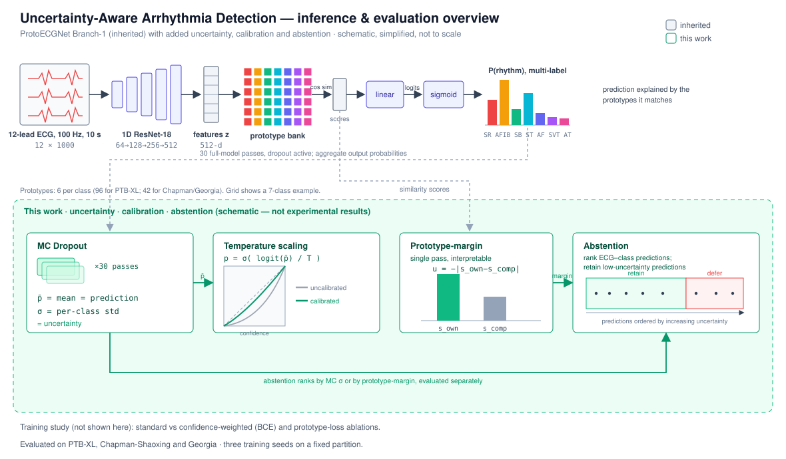

# Uncertainty-Aware Arrhythmia Detection from ECG Signals

Code for the MSc dissertation *Uncertainty-Aware Arrhythmia Detection from ECG Signals*
(University of Nottingham, 2026). It extends the interpretable **ProtoECGNet** rhythm
classifier with Monte Carlo Dropout uncertainty, an interpretable prototype-margin,
temperature-scaling calibration, and abstention, evaluated on PTB-XL, Chapman-Shaoxing
and Georgia.



## Setup

```bash
conda env create -f environment.yml
conda activate ecg_env
```

## Data

PTB-XL, Chapman-Shaoxing and the PhysioNet/Computing in Cardiology 2021 (Georgia)
datasets are publicly available on PhysioNet. Each has its own loader in `src/`.

## Run

Runs are driven by one script, selecting the dataset and stage by argument:

```bash
sbatch run.sh <ptbxl|chapman|georgia> <prep|standard|bce|calib>
```

Examples:

```bash
sbatch run.sh chapman standard   # train the standard pipeline
sbatch run.sh ptbxl  calib       # calibration + abstention evaluation
```

## Results

Seed-averaged macro AUROC and ECE (uncalibrated then temperature-scaled):

| Dataset | AUROC | ECE -> cal |
|---|---|---|
| PTB-XL  | 0.87 | 0.071 -> 0.056 |
| Chapman | 0.98 | 0.051 -> 0.028 |
| Georgia | 0.92 | 0.070 -> 0.053 |

Temperature scaling lowers calibration error on every dataset at no cost to AUROC.

## Citation

```bibtex
@mastersthesis{krishnamoorthy2026uncertainty,
  title  = {Uncertainty-Aware Arrhythmia Detection from ECG Signals},
  author = {Krishnamoorthy, Pawan Subramanyan},
  school = {University of Nottingham},
  year   = {2026}
}
```

## Acknowledgements

Built on **ProtoECGNet** (Sethi et al., MLHC 2025); the interpretable prototype
architecture and its training procedure are theirs. See `CONTRIBUTIONS.md` for what is
inherited versus added here.
